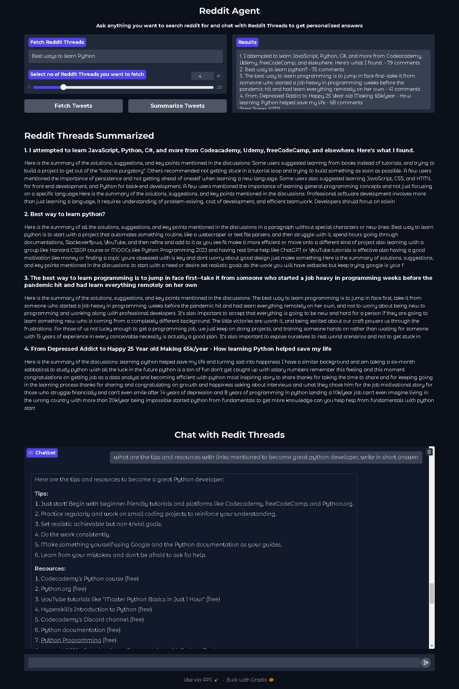

# Reddit AI Agent
Reddit AI Agent is a smart Reddit assistant that lets you search for any query, fetching top Reddit threads along with their most relevant comments. It provides three core features: retrieving top threads, summarizing threads and comments for quick insights, and enabling a conversational chat feature powered by Retrieval-Augmented Generation (RAG) to offer personalized answers based on the thread content.



## Video
[Watch the demo video](path/to/demo-video-url)

## Features
- **Fetch Top Reddit Threads**: Retrieves top threads related to any query, based on user preferences.
- **Summarize Content**: Summarizes thread discussions and comments for quick overviews.
- **Conversational Interface**: Allows you to chat directly with thread summaries and comments for an interactive experience.
- **User-Friendly UI**: Offers an intuitive interface with logging and monitoring features.

## Tools and Libraries
- **PRAW**: Fetches Reddit data (threads, comments).
- **LangChain & LangSmith**: Used for building and managing AI chains and logs.
- **Groq API**: Provides LLM model support for natural language processing.
- **FAISS Vector Store**: For efficient data indexing and searching.
- **Hugging Face Embeddings Model**: Converts text into embeddings for semantic searches.

## API Keys Needed
- **Reddit API Key**: Register and obtain credentials [here](https://www.geeksforgeeks.org/how-to-get-client_id-and-client_secret-for-python-reddit-api-registration/).
- **Groq API Key**: Register and obtain credentials from [Groq Console](https://console.groq.com/).

## Setup and Run
1. **Create `.env` file** with the following keys:
   ```env
   REDDIT_API_CLIENT_ID="<your_reddit_client_id>"
   REDDIT_API_SECRET="<your_reddit_secret>"
   REDDIT_USER_AGENT="<your_user_agent>"
   GROQ_API_KEY="<your_groq_key>"
   ```

2. **Installation and Running**:
   ```env
   pip install -r requirements.txt
   cd src
   gradio UI.py
   ```

## TODO
- Add more data sources Twitter, Quora.
- Add support for Cloud Embeddings using pinecone
- Add support for Cloud Deployment